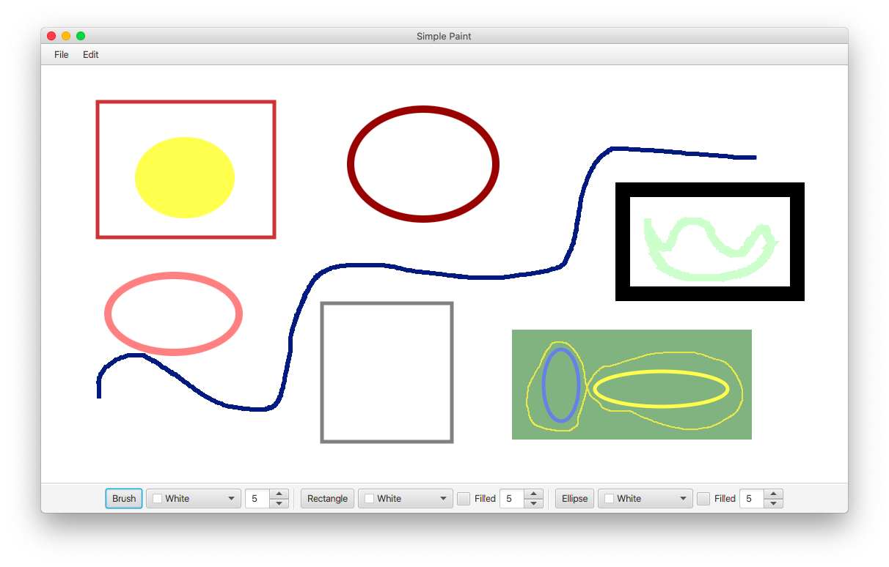
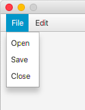
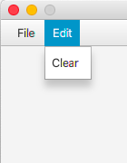
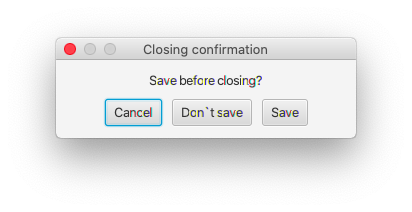

# SimplePaintProject
Simple paint project on Java (using javafx).

### Usage example

Available tools:
- _brush_,
- _rectangle_, 
- _ellipse_.

For any tool you can change:
- _thickness (border size for rectangle and ellipse)_,
- _color_,
- _"filled" property (__only__ for rectangle and ellipse)_.

### Menu items

Also you can:

- _open a ".png" file for editing_,
- _save your painting as ".png" file_,
- _close the programme (you will be proposed to save the progress)_.

